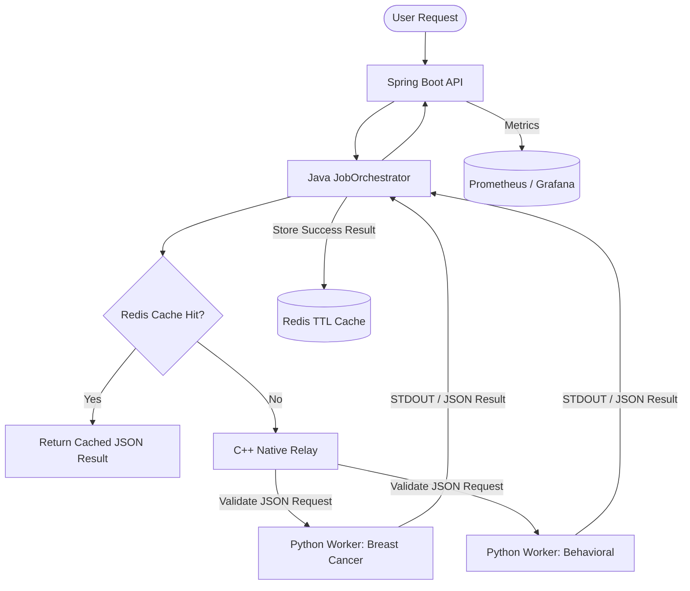

## 🏥 HealthStream Inference Engine
> A High-Performance Java Orchestrator for Isolated Python ML Workers.


HealthStream is a specialized micro-orchestrator designed to bridge the gap between **Java-based Backend Systems** and **Python-based ML Models**. It focuses on **Process Isolation**, **Resource Efficiency**, and **Production-Grade Observability**.

---

## Why This Project Exists

Many real-world backend systems need to invoke Python-based data science or ML logic without embedding Python directly into the application runtime.

This project explores a safer architecture:
- keep the API and orchestration layer in Java
- isolate compute-heavy logic in Python workers
- validate requests at a native boundary
- return structured JSON for reliable downstream processing

This mirrors practical production concerns such as fault isolation, observability, portability, and controlled worker execution.

---

##  Key Engineering Highlights
* **Process Isolation:** Mimics production ML infra by separating compute from the API layer.
* **Resource Management:** Fixed thread pool to prevent CPU exhaustion.
* **Redis Caching:** Repeated identical inference requests can return directly from cache, avoiding unnecessary relay validation and Python worker startup.
* **Observability:** Prometheus-ready metrics for real-time monitoring.


---
## How it Works (Architecture)

The project is split into multiple stages to keep inference execution safe, modular, and efficient:

1. **The Java Orchestrator (Spring Boot)**  
   **Request Handling:** Accepts structured inference requests through the API layer.

   **Redis Cache Check:** Before invoking native validation or Python execution, the orchestrator checks Redis for a cached response using a request signature derived from `task + feature hash`. This provides the cheapest execution path first for repeated identical requests.

   **Process Management:** Uses `ProcessBuilder` to spin up Python workers on demand. I chose this over JNI for process isolation—if the ML model leaks memory, it doesn't take down the Java API.

   **Thread Safety:** Uses a fixed thread pool to control how many ML jobs run at once, preventing CPU exhaustion.

   **Dynamic Pathing:** The system automatically resolves relay and worker paths relative to the project root for better portability across MacOS, Linux, and Docker.

2. **The Native Validation Layer (C++)**  
   A lightweight relay validates request structure and feature constraints before inference execution.

3. **The ML Workers (Python)**  
   **Scikit-learn Models:** Handle the actual inference logic.

   **CLI-Driven:** Workers communicate through a simple CLI contract and return structured JSON for Java to consume.

4. **The Cache Layer (Redis)**  
   Successful inference responses are cached for 30 minutes. Repeated identical requests return directly from Redis instead of re-running validation and worker execution.


---
## 🏗️ System Architecture

The engine utilizes a staged "Manager-Worker" pattern to ensure high availability, clean data contracts, and efficient repeated inference handling.

The Java orchestrator supervises Redis cache checks, native validation, and Python worker execution with timeout control
and forced termination to prevent hung inference processes.



## Current Status
- Spring Boot API is running locally and accepts structured inference requests
- Native C++ relay validation is integrated and working
- Python worker execution is connected end-to-end
- Redis caching is integrated before relay validation and Python worker execution
- Repeated identical inference requests are now served from cache
- Cache behavior has been validated locally with:
  - `CACHE MISS`
  - `CACHE STORED`
  - `CACHE HIT`
- Local validation confirms that repeated identical requests bypass relay validation and Python worker execution through Redis cache hits


## Redis Cache Validation

The cache layer was validated locally with repeated identical inference requests.

### Observed Flow
- First request → `CACHE MISS`
- Successful response stored in Redis → `CACHE STORED`
- Second identical request → `CACHE HIT`

### Cache Policy
- **Key**: `task + SHA-256 hash(features)`
- **TTL**: 30 minutes
- **Store rule**: only successful inference responses are cached

This optimization reduces repeated relay validation and Python worker startup overhead for duplicate inference requests.


### Native Validation Layer (C++)

A lightweight C++ relay sits between the Java orchestrator and the Python worker.

Responsibilities:

- Validate incoming inference requests
- Ensure feature vector integrity
- Return structured JSON errors
- Demonstrate Linux-native C++ integration

The relay communicates with the Java orchestrator through **stdin/stdout messaging**.

## Technology Stack

| Layer | Technology |
|------|------------|
| API Layer | Spring Boot |
| Orchestration | Java ProcessBuilder |
| Cache Layer | Redis |
| Native Validation | C++ |
| ML Runtime | Python (Scikit-learn) |
| Build System | Maven / CMake |
| Containerization | Docker |
| Observability | Prometheus / Grafana |


## Quick Start

### Clone the repository
```bash
git clone https://github.com/kkauy/HealthStream-Inference-Engine.git
cd HealthStream-Inference-Engine

```
## Start Redis
docker run -d --name hs-redis -p 6379:6379 redis:7-alpine

## Run the Spring Boot orchestrator
cd hs-orchestrator-java
mvn spring-boot:run

## Health Check
curl http://localhost:8080/actuator/health

## Test the API

curl -X POST http://localhost:8080/api/v1/jobs/inference \
-H "Content-Type: application/json" \
-d '{"id":"123","task":"breast_cancer","features":[1,1,1,1,1,1,1,1,1,1,1,1,1,1,1,1,1,1,1,1,1,1,1,1,1,1,1,1,1,1]}'


---

##  Run with Docker

```md
## Run with Docker

## Containerization (In Progress)

Build the container image:

```bash
docker build -t healthstream .


```bash
docker build -t healthstream .

```
## Run the service:
http://localhost:8080


## The API will be available at:
http://localhost:8080

## Test the API

Trigger an inference job:

```bash
curl -sS -X POST http://localhost:8080/api/v1/jobs/inference/123

```

## Testing & Reliability

Reliability is built into the core via automated integration testing and safe multi-process coordination:

- **Robot Framework:** Used for end-to-end API testing to ensure the Java-to-Python bridge returns valid diagnostic JSON.
- **Asynchronous Stream Handling:** Prevents deadlock when Python output exceeds process buffers.
- **Error Mapping:** Python worker output and failure paths are surfaced through the Java orchestration layer to make debugging distributed failures easier.
- **Timeout Control:** The orchestrator enforces worker execution limits to prevent hung inference processes.
- **Cache Validation:** Repeated identical inference requests have been validated locally to confirm `CACHE MISS`, `CACHE STORED`, and `CACHE HIT` behavior.

## To run the tests:
```bash
pip install robotframework robotframework-requests
robot tests/api_integration.robot

```

---

##  Engineering Journey & Lessons Learned
The "Java-Python Gap"
The biggest hurdle wasn't the ML itself—it was the Data Contract. Initially, stream buffering caused the Java process to "hang" when Python output exceeded the buffer size.

Solution: Implemented a dedicated Asynchronous Stream Gobbler thread to consume STDOUT and STDERR concurrently, preventing deadlock.

Handling "Zombie" Processes
Early versions left orphaned Python processes if the JVM crashed.

Solution: Integrated JVM Shutdown Hooks and strict Process.destroy() logic to ensure 100% resource cleanup.

Path Portability
To solve "it works on my machine" issues, I refactored the logic from absolute paths to Relative Discovery, ensuring the engine remains "Plug and Play" across MacOS, Linux, and Docker environments.

## Future Roadmap
- [ ] Add Docker Compose for one-command startup of the full local stack
- [ ] Return and cache only the final JSON response from Python workers
- [ ] Add cache hit/miss metrics to Prometheus
- [ ] Add benchmark comparison for cached vs uncached inference latency
- [ ] Integration with Apache Kafka for asynchronous task queuing
- [ ] Support for GPU-accelerated Python workers
- [ ] Dynamic worker scaling based on request pressure

