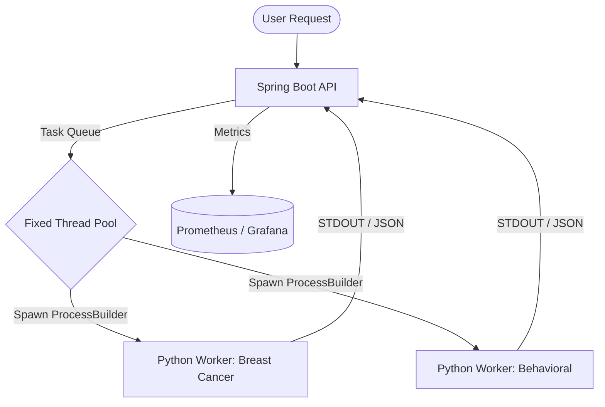

## 🏥 HealthStream Inference Engine
> A High-Performance Java Orchestrator for Isolated Python ML Workers.

HealthStream is a specialized micro-orchestrator designed to bridge the gap between **Java-based Backend Systems** and **Python-based ML Models**. It focuses on **Process Isolation**, **Resource Efficiency**, and **Production-Grade Observability**.

---

## 🌟 Key Engineering Highlights
* **Process Isolation:** Mimics production ML Infra by separating compute from API.
* **Resource Management:** Fixed thread pool to prevent CPU exhaustion.
* **Observability:** Prometheus-ready metrics for real-time monitoring.
🏗️ How it Works (Architecture)
The project is split into two main parts to keep things clean and modular:

1. The Java Orchestrator (Spring Boot)
   Process Management: Uses ProcessBuilder to spin up Python workers on demand. I chose this over JNI for Process Isolation—if the ML model leaks memory, it doesn't take down the Java API.

Thread Safety: Implemented a fixed thread pool to control how many ML jobs run at once, preventing CPU exhaustion.

Dynamic Pathing: No hardcoded paths! The system automatically locates the Python environment relative to the project root.

2. The ML Workers (Python)
   Scikit-learn Models: Handles the actual math. Currently supports Breast Cancer and Behavioral Analysis tasks.

CLI-Driven: Communicates via a clean CLI contract (--task, --input), returning structured JSON that Java can easily parse.

## 🏗️ System Architecture

The engine utilizes a "Manager-Worker" pattern to ensure high availability and clean data contracts.

Quick Start:

# Clone the repository
git clone [https://github.com/kkauy/HealthStream-Inference-Engine.git](https://github.com/kkauy/HealthStream-Inference-Engine.git)
cd healthstream-inference-engine

# Build and Run with Docker
docker-compose up --build

🧪 Testing & Reliability

Reliability is built into the core via automated integration testing:

Robot Framework: Used for end-to-end API testing to ensure the Java-to-Python bridge returns valid diagnostic JSON.

Error Mapping: Python STDERR is captured and mapped to custom Java Exceptions, making debugging distributed failures 10x faster.
Bash

# To run the tests:
pip install robotframework robotframework-requests
robot tests/api_integration.robot

🧠 Engineering Journey & Lessons Learned
The "Java-Python Gap"
The biggest hurdle wasn't the ML itself—it was the Data Contract. Initially, stream buffering caused the Java process to "hang" when Python output exceeded the buffer size.

Solution: Implemented a dedicated Asynchronous Stream Gobbler thread to consume STDOUT and STDERR concurrently, preventing deadlock.

Handling "Zombie" Processes
Early versions left orphaned Python processes if the JVM crashed.

Solution: Integrated JVM Shutdown Hooks and strict Process.destroy() logic to ensure 100% resource cleanup.

Path Portability
To solve "it works on my machine" issues, I refactored the logic from absolute paths to Relative Discovery, ensuring the engine remains "Plug and Play" across MacOS, Linux, and Docker environments.

🚧 Future Roadmap
[ ] Integration with Apache Kafka for asynchronous task queuing.

[ ] Support for GPU-accelerated Python workers.

[ ] Dynamic Worker Scaling based on request pressure.